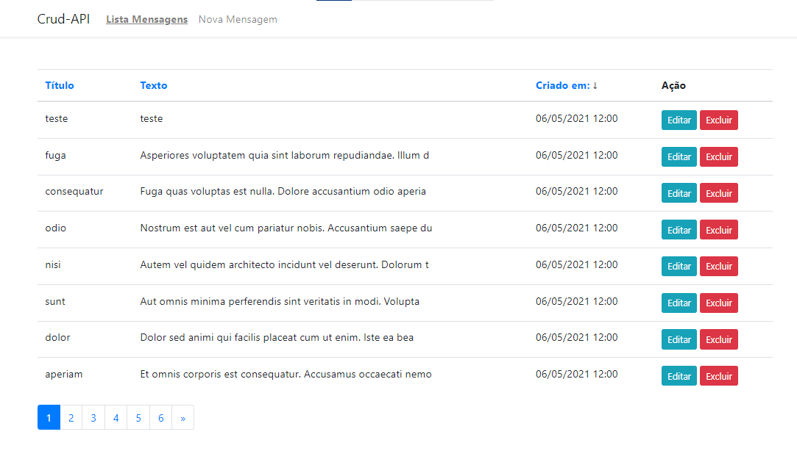

# CrudAPI
Um projeto muito simples com Laravel e Vue.js como um aplicativo de página única (SPA).

## Instalação
- Clone o repositório com __git clone__
- edite o arqruivo __.env.example__ para __.env__ e configure as credencias de banco de dados
- Execute o comando __composer install__
- Execute o comando __php artisan key:generate__
- Execute o comando __php artisan migrate --seed__ (contem alguns dados para teste)
- Execute o comando __npm install__ 
- Execute o comando __npm run dev__ 
- Pronto, inicie o URL principal

